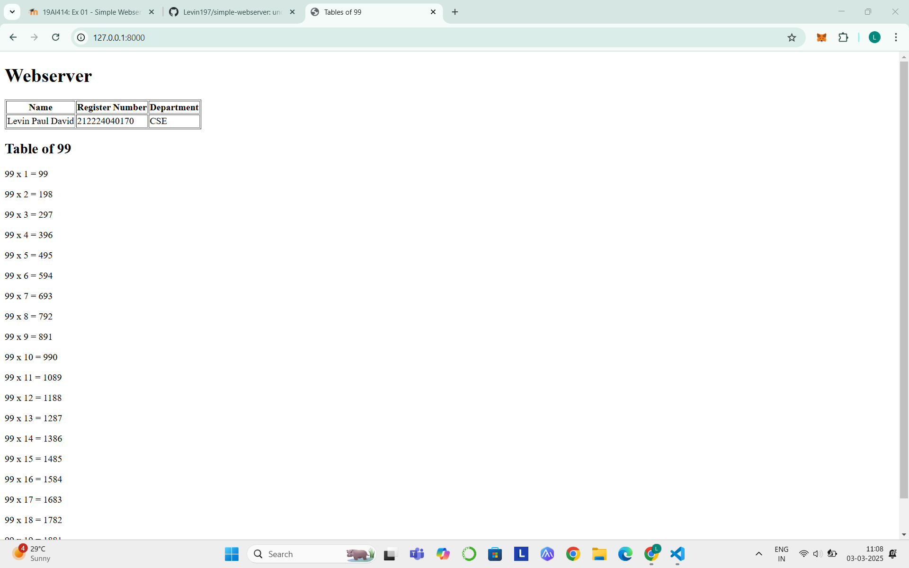

 
# EX01 Developing a Simple Webserver
## Date:

## AIM:
To develop a simple webserver to serve html pages and display the configuration details of laptop.

## DESIGN STEPS:
### Step 1: 
HTML content creation.

### Step 2:
Design of webserver workflow.

### Step 3:
Implementation using Python code.

### Step 4:
Serving the HTML pages.

### Step 5:
Testing the webserver.

## PROGRAM:
```html
<!DOCTYPE html>
<html lang="en">
<head>
    <meta charset="UTF-8">
    <meta name="viewport" content="width=device-width, initial-scale=1.0">
    <title>Tables of 99</title>
</head>
<body>
    <h1>Webserver</h1>
    <table border = "1">
    <tr>
        <th>Name</th>
        <th>Register Number</th>
        <th>Department</th>
    </tr>
    <tr>
        <td>Levin Paul David</td>
        <td>212224040170</td>
        <td>CSE</td>
    </tr>
    </table>
    <h2>Table of 99</h2>
    <p>99 x 1 = 99</p>
    <p>99 x 2 = 198</p>
    <p>99 x 3 = 297</p>
    <p>99 x 4 = 396</p>
    <p>99 x 5 = 495</p>
    <p>99 x 6 = 594</p>
    <p>99 x 7 = 693</p>
    <p>99 x 8 = 792</p>
    <p>99 x 9 = 891</p>
    <p>99 x 10 = 990</p>
    <p>99 x 11 = 1089</p>
    <p>99 x 12 = 1188</p>
    <p>99 x 13 = 1287</p>
    <p>99 x 14 = 1386</p>
    <p>99 x 15 = 1485</p>
    <p>99 x 16 = 1584</p>
    <p>99 x 17 = 1683</p>
    <p>99 x 18 = 1782</p>
    <p>99 x 19 = 1881</p>
    <p>99 x 20 = 1980</p>

</body>
</html>
```


## OUTPUT:



## RESULT:
The program for implementing simple webserver is executed successfully.
